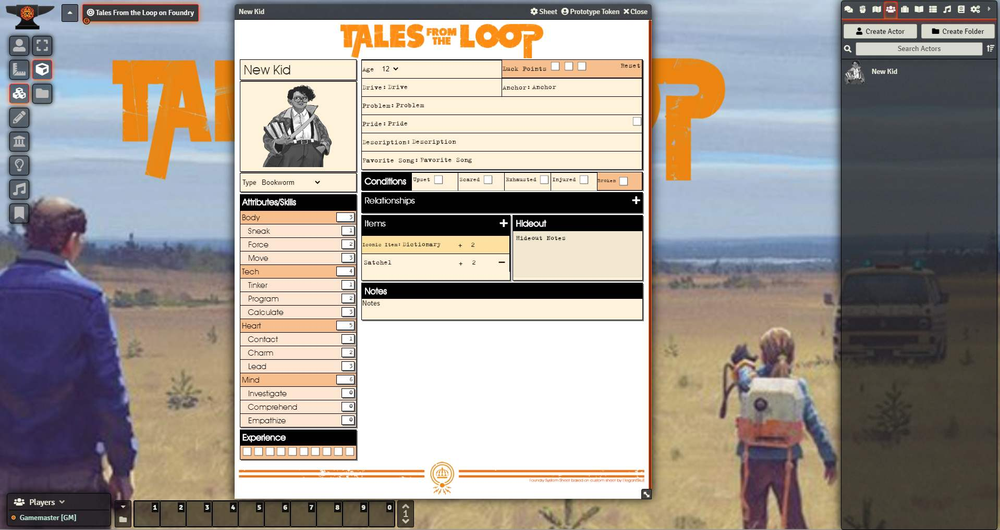

# Tales from the loop and Things From the Flood

This is an implementation of the Tales from the Loop and Things from the Flood game systems for Foundry VTT.

To play Tales from the Loop simply create a kid Character and have fun, for Things from the Flood make that a teen character.  If you want to make the aesthetics of the Things from the Flood system match the style in the books install the companion <a href="https://foundryvtt.com/packages/tftflood/">Things from the Flood Mod</a> from inside the foundry client

This was coded in my spare time over the course a few days so there may be a couple bugs or things that can be improved! 

feedback is always welcome.
-Dr Ogres

<ul>
    <li>TODO - code clean-up and documentation of system use</li>
</ul>

<h3>Version 0.9.0</h3>

* Added Swedish localization thanks to Mikael  |  Lagt till svensk lokalisering tack vare Mikael

<h3>Version 0.8.9</h3>

* Added Brazilian Portugese localization thanks lmartim! |  Adicionado português brasileiro obrigado lmartim!

<h3>Version 0.8.8</h3>

* Added sheet for Things From the Flood Teen.  Module for CSS styling is coming soom(tm)

<h3>Version 0.8.7</h3>

* added support for La france des Années 80 kid types
    * initial support for extending kid types through home brew settings not fully implemented at this time.

<h3>Version 0.8.4</h3>

* Spainish Localization |  Localización del idioma español
    * Thanks to mikeldevcosmico

<h3>Version 0.8.3</h3>

* fixed Forge Bazaar issue
* fixed chat card localization on reroll bug.

<h3>Version 0.8.0</h3>

* German Language Localization  |  Deutschsprachige Übersetzung.
    * Thanks to GreenTea173!

<h3>Version 0.7.9</h3>

* Fixed roll logic - If a pool is 0 the pool becomes 1d6cs6 (as per the clarification in flood).
* added re-roll button to already re-rolled items to allow for expenditure of luck after a pushed roll

<h3>Version 0.7.8</h3>

* French Language Localization | Localisation de la langue française
    * thanks to Antoine and Carter!
* tweaks to CSS

<h3>Version 0.7.7</h3>

* minor bug fix.  
* restrictied visibility of reroll button by owner in chat.

<h3>Version 0.7.6</h3>

* Added Re-roll buttons - Feature Complete!

<h3>Version 0.7.5</h3>

* Stytled chat and other windows to match core system
* Beutified Roll Dialog
* Added breakdown of components to the Roll Dialog (you can see why your pool is what it is)
* Styled chat card for rolls, and ensured dice so nice played well with system.

<h3>Version 0.7.1</h3> 

* minor bug fix

<h3>Version 0.7.0</h3> 

* Full roll Implementation complete.  System is now feature complete and ready for your games.
* Minor Bug fixes
* minor CSS tweaks
