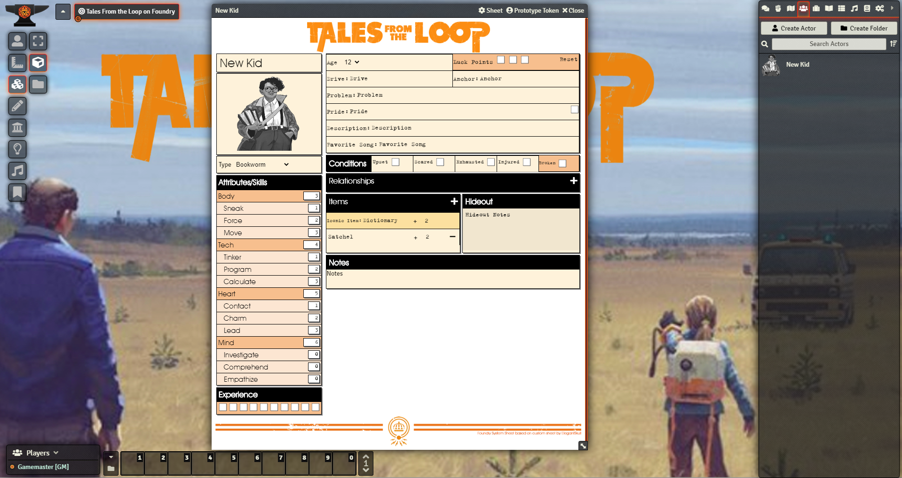

# Tales from the loop

This is an implementation of the Tales from the Loop game system for Foundry VTT.  

The current sheet implements the data model and is set up for record-keeping. It is more than possible to run a game with the system in this state.

I am still working out how I want to implement building dice pools and rolling but that should be relatively soon at which point the system will be feature complete.

in the mean time:  Roll dice as such a simple /r #d6cs6  where # is the number of dice in your pool.  simple as that.

feedback is always welcome.
-Dr Ogres
