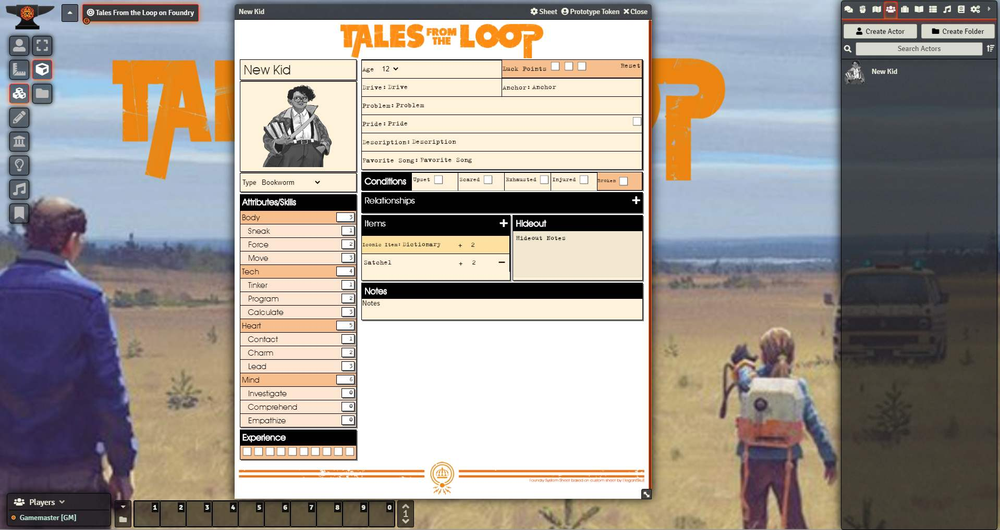

# Tales from the loop and Things From the Flood

This is an implementation of the Tales from the Loop and Things from the Flood game systems for Foundry VTT.

To play Tales from the Loop simply create a kid Character and have fun, for Things from the Flood make that a teen character.  If you want to make the aesthetics of the Things from the Flood system match the style in the books install the companion [Things from the Flood Mod](https://foundryvtt.com/packages/tftflood/) from inside the foundry client

This was coded in my spare time over the course a few days so there may be a couple bugs or things that can be improved! 

feedback is always welcome.
-Dr Ogres
